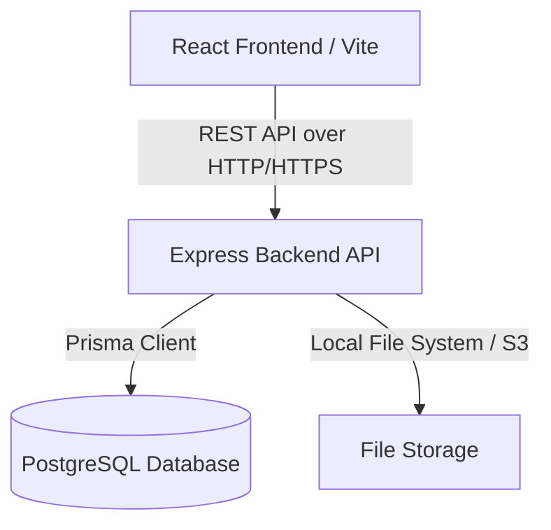

# Architecture & Design

## Overall Architecture
TaskSuite utilizes a decoupled Client-Server architecture. The frontend is a Single Page Application (SPA) built with React, communicating via RESTful APIs to a Node.js/Express backend. Data is persisted in a PostgreSQL database using Prisma ORM. 



## Tech Stack Reasoning

### Frontend
- **React + Vite**: Provides a fast, modern development experience with HMR and optimized production builds.
- **TypeScript**: Ensures type safety, reducing runtime errors and improving developer experience and code maintainability.
- **TailwindCSS & shadcn/ui**: Tailwind provides utility-first CSS for rapid styling, while shadcn/ui offers accessible, premium, unstyled components that we can easily customize without the bloat of heavy component libraries.
- **Zustand**: A lightweight and unopinionated state management solution for UI states, simpler than Redux for this scale.
- **TanStack Query (React Query)**: Handles server-state caching, synchronization, and complex data fetching requirements effortlessly.
- **React Hook Form + Zod**: Provides performant and flexible form validation with strict type checking.

### Backend
- **Node.js + Express.js**: Industry standard for building scalable and fast I/O bound APIs. Highly extensible via middleware.
- **TypeScript**: Shared types with frontend where applicable, preventing interface mismatches.
- **PostgreSQL**: A powerful, open-source object-relational database system known for reliability and data integrity.
- **Prisma ORM**: Offers an intuitive data model, automated migrations, and a fully type-safe query builder, drastically reducing database-related bugs.

### DevOps & Tooling
- **Docker**: Ensures consistency across development, testing, and production environments.
- **Jest & Supertest**: Industry standard testing framework and assertion library for Express APIs.
- **Swagger**: Standardized, interactive API documentation.

## Folder Structure

### Frontend Structure
```text
src/
├── app/          # App-wide config, providers, and global styles
├── components/   # Reusable UI components (buttons, inputs, modals)
├── features/     # Feature-based modules (auth, tasks, users) containing feature-specific components, hooks, api calls
├── hooks/        # Shared custom React hooks
├── layouts/      # Application layouts (DashboardLayout, AuthLayout)
├── pages/        # Page components corresponding to routes
├── routes/       # React Router definitions
├── services/     # Axios instances, generic API handlers
├── store/        # Global state (Zustand)
├── types/        # Global TypeScript types and interfaces
├── utils/        # Helper functions, formatters, constants
└── styles/       # Global CSS / Tailwind configurations
```

### Backend Structure
```text
src/
├── config/       # Environment variables, database connection, external service configs
├── controllers/  # Express route handlers, orchestrating requests/responses
├── middlewares/  # Express middlewares (auth, logging, error handling)
├── routes/       # Express router definitions, mapping paths to controllers
├── services/     # Business logic layer, keeping controllers thin
├── repositories/ # Data access layer (Prisma calls), separating DB logic from business logic
├── prisma/       # Prisma schema and migrations
├── utils/        # Shared utilities (hashers, loggers)
├── validators/   # Zod validation schemas for incoming request bodies
├── types/        # TypeScript interfaces and type definitions
└── tests/        # Unit and integration tests
```

## Scalable Design Decisions
1. **Controller-Service-Repository Pattern**: The backend separates concerns cleanly. Controllers handle HTTP, Services handle business rules, and Repositories handle data persistence. This makes mocking easier for tests and allows swapping out the database or ORM later without touching business logic.
2. **Feature-Sliced Design (Frontend)**: Organizing frontend code by feature (auth, tasks) rather than strictly by file type (all components, all hooks) makes it easier to scale the application as new features are added.
3. **Stateless Authentication**: JWT tokens allow for horizontally scalable backend instances without relying on shared session memory.
4. **Pagination & Filtering at Database Level**: Ensures the app remains performant even with millions of task records.

## Setup Instructions

### Prerequisites
- Node.js (v18 or higher)
- Docker Desktop
- Git

### Running Locally (Dockerized)
1. Clone the repository.
2. Copy `.env.example` to `.env` and fill in the values.
3. Run `docker-compose up -d` to start the PostgreSQL database and backend server.
4. Run Prisma migrations: `npm run prisma:migrate` (inside the backend container).
5. Start the frontend: `npm install && npm run dev` in the frontend directory.
