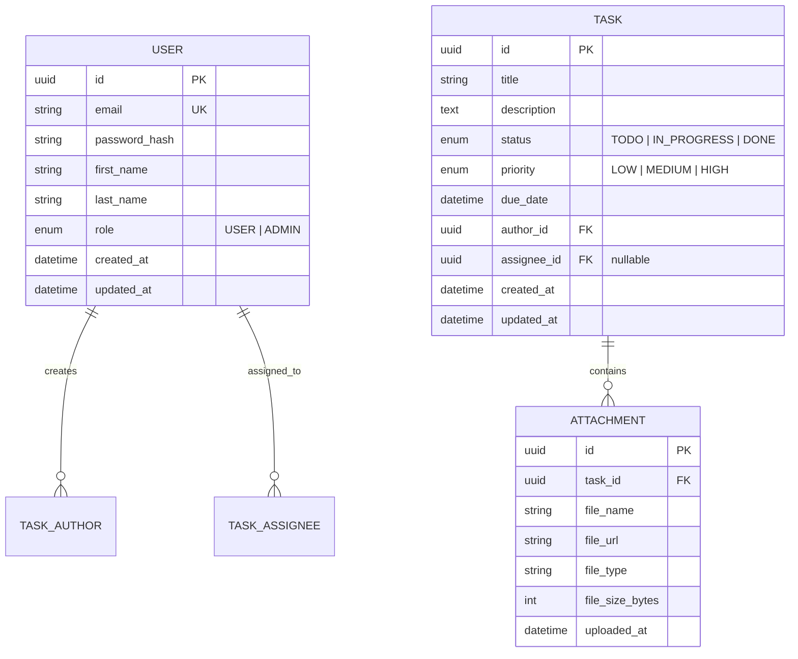

# Database Design

## Overview
The database uses PostgreSQL to store relational data for the Task Management System. The schema is designed to be normalized and scalable.

## Entity Relationship Diagram (ERD)

## Schema Details

### User Table
Stores authentication and profile information.
- `role`: Enables role-based access control (RBAC).

### Task Table
Stores the core task entities.
- Indexed by `assignee_id` and `status` to allow fast querying on the dashboard.
- `author_id` tracks who created the task.
- `assignee_id` is nullable, allowing tasks to be unassigned initially.

### Attachment Table
Stores metadata for uploaded PDF documents (max 3 per task, enforced at application level).
- `file_url` will point to the storage location (local disk or S3 bucket).
