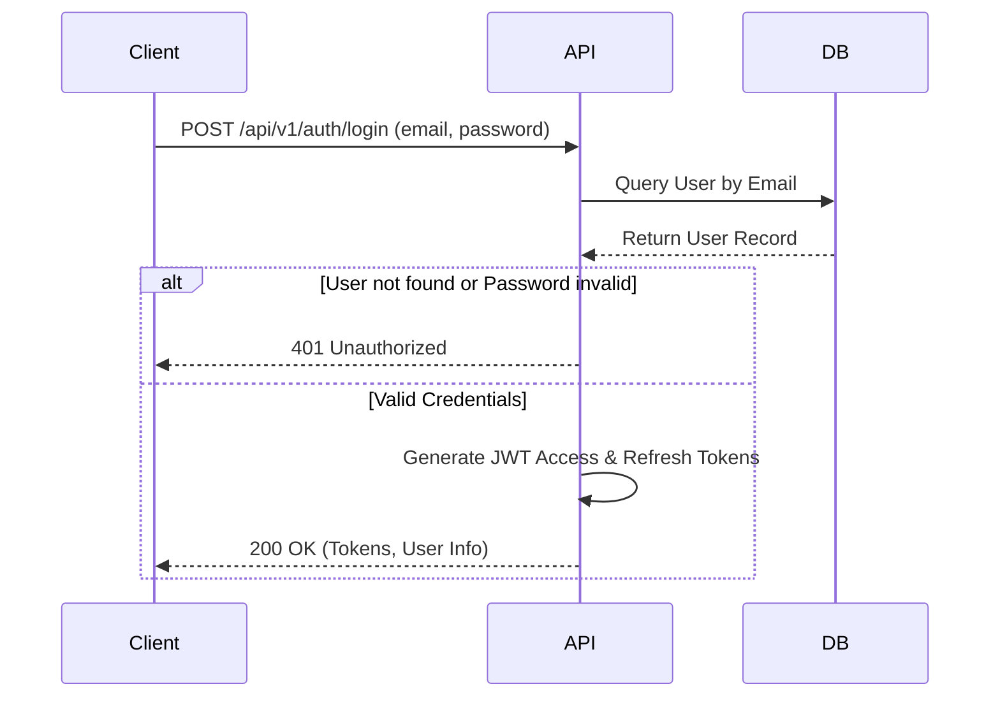
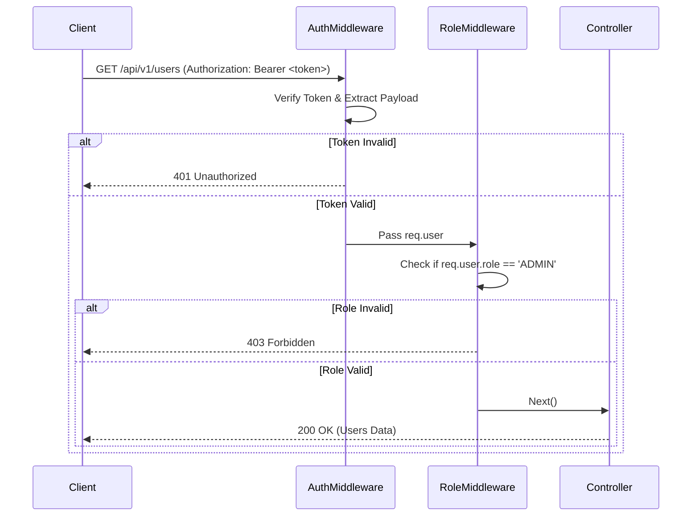
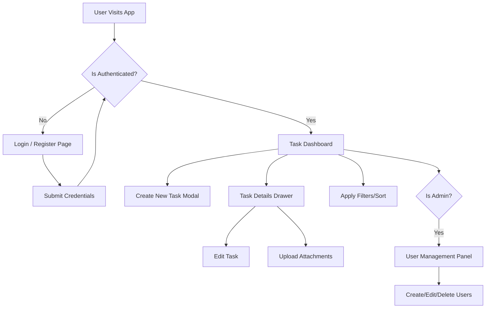

# Flowcharts & Application Flow

## 1. Authentication Flow
This describes how a user logs into the system and receives an access token.

## 2. Authorization Flow (Role-Based Access)
When a user requests a protected resource.

## 3. General Application Flowchart
High-level overview of the application navigation.

